# 梦序章 18 节点关卡流程图（执行版）

这份文档把 `N01` 到 `N18` 整理成可直接交给程序、关卡和演出使用的执行流程图。
目标不是补设定，而是明确每个节点的进入条件、控制状态、关键事件、完成条件和跳转关系。

## 1. 主流程图

```mermaid
flowchart TD
    Start([章节开始])

    subgraph A["A. 规则建立与缺失"]
        N01["N01 风沙进入<br/>黑场 -> 风沙 -> 画面显影 -> 解锁输入"]
        N02["N02 第一轮点名<br/>建立规则可信度"]
        D02{"第一轮有效对象<br/>是否全部完成点名?"}
        N03["N03 第一段过渡<br/>从规则层过渡到异常层"]
        N04["N04 第二轮点名<br/>宿舍载入缺失状态"]
        D04{"是否点到异常小孩<br/>原位置?"}
        N05["N05 死亡幻象残留<br/>蓝线残像 -> 轻闪 -> 消散"]
        N06["N06 办公室窗口裂缝<br/>路过窗口看到照片"]
    end

    subgraph B["B. 删除与身份断裂"]
        N07["N07 第三轮点名<br/>第一次异常 -> 第二次被吞 -> 名册抹除"]
        D07{"小杰是否已被<br/>规则删除?"}
        N08["N08 编号牌析构<br/>靠近自己床位触发"]
        N09["N09 成年小杰走廊段<br/>离开宿舍后切到成年版本"]
        N10["N10 涂鸦抹除与童年切换<br/>经过涂鸦节点后翻回童年"]
    end

    subgraph C["C. 孤立感建立与唯一回应"]
        N11["N11 第一次呼喊编号<br/>自动放慢 -> 无人回应"]
        N12["N12 第二次呼喊编号<br/>再次放慢 -> 依然无人回应"]
        N13["N13 叶子出现<br/>走廊尽头唯一回应者"]
    end

    subgraph D["D. 空间显影与现实闭环"]
        N14["N14 闪烁地狱场景<br/>低频闪烁 -> 地狱层侵入"]
        N15["N15 走廊尽头空间贯通<br/>叶子背后裂口 -> 设施空间显出"]
        N16["N16 通透世界显影<br/>黑底白线 -> 设施残片显出"]
        N17["N17 梦醒<br/>快速退梦 -> 小杰醒来"]
        N18["N18 新闻报道闭环<br/>新闻验证 38 号基地事故"]
        End([章节结束])
    end

    Start --> N01 --> N02 --> D02
    D02 -- 否 --> N02
    D02 -- 是 --> N03 --> N04 --> D04
    D04 -- 否 --> N04
    D04 -- 是 --> N05 --> N06 --> N07 --> D07
    D07 -- 否 --> N07
    D07 -- 是 --> N08 --> N09 --> N10 --> N11 --> N12 --> N13 --> N14 --> N15 --> N16 --> N17 --> N18 --> End
```

## 2. 运行时状态约定

建议把本章做成单一章节状态机，至少维护以下 6 组运行时变量。

| 状态名 | 建议值 | 用途 |
| --- | --- | --- |
| `ChapterNode` | `N01` ~ `N18` | 统一驱动节点进入、退出、存档恢复和调试跳转 |
| `DormState` | `Round1_Full` / `Round2_Missing` / `Round3_Deleted` | 控制宿舍布局、床位对象、可交互集合 |
| `PlayerForm` | `ChildJie` / `AdultJie` / `ChildJie_Reverted` | 控制角色对象、动画集、走廊版本 |
| `RosterState` | `Normal` / `MissingHint` / `JieErased` | 控制名册 UI 的弹出和条目状态 |
| `ControlMode` | `Locked` / `FreeMove` / `FreeMove_RollCall` / `AutoSlow` / `MicroAdjustOnly` | 控制玩家输入权限 |
| `AbnormalLayer` | `None` / `ResidualGhost` / `Deconstruct` / `HellFlicker` / `TransparentWorld` | 控制显像、析构、闪烁和通透世界表现 |

## 3. 节点执行表

| 节点 | 进入条件 | 玩家控制 | 核心事件 | 完成条件 / 跳转 |
| --- | --- | --- | --- | --- |
| `N01 风沙进入` | 章节加载完成 | 前 `0.5s` 锁输入，随后 `FreeMove` | 黑场、风沙、画面显影、角色落点 | 显影结束后进入 `N02` |
| `N02 第一轮点名` | `N01` 完成 | `FreeMove_RollCall` | 全部床位对象可点名，统一成功反馈 | 有效对象全部完成后进 `N03` |
| `N03 第一段过渡` | `N02` 完成 | `FreeMove` | 开放门外短过渡区，异常气氛加重 | 玩家通过过渡区后进 `N04` |
| `N04 第二轮点名` | `N03` 完成 | `FreeMove_RollCall` | `DormState=Round2_Missing`，异常小孩实体移除 | 玩家点到异常小孩原位置时进 `N05`，否则留在本节点 |
| `N05 死亡幻象残留` | `N04` 命中异常原位 | 短锁输入后恢复 | 蓝线残像生成，保持旧姿态，轻闪后菌群化消散 | 残像消散后进 `N06` |
| `N06 办公室窗口裂缝` | `N05` 完成 | `FreeMove`，不可进入办公室 | 路过窗口，看到姨妈、桌面照片、被档案遮住脸的成年男人 | 玩家通过窗口观察点后进 `N07` |
| `N07 第三轮点名` | `N06` 完成 | 前半可操作，删除发生时短锁输入 | 玩家再次确认自己，第一次异常，第二次吞掉，名册自动弹出并抹除小杰条目 | `RosterState=JieErased` 后进 `N08` |
| `N08 编号牌析构` | `N07` 完成 | `FreeMove`，靠近触发 | 接近自己床位或编号牌，触发失稳、脱壳、消失 | 编号牌消失后进 `N09` |
| `N09 成年小杰走廊段` | `N08` 完成并离开宿舍 | `FreeMove` | `PlayerForm=AdultJie`，走廊切到成年版，墙面出现被抹掉的小杰涂鸦 | 玩家经过涂鸦节点后进 `N10` |
| `N10 涂鸦抹除与童年切换` | `N09` 命中涂鸦节点 | 输入可轻微压制，不长锁 | 成年小杰像被剥掉一层，控制对象切回童年小杰，位置与朝向连续 | 切换完成后进 `N11` |
| `N11 第一次呼喊编号` | `N10` 完成 | 进入触发区后 `AutoSlow` | 走廊孩子继续玩耍，童年小杰第一次呼喊编号，无人回应 | 呼喊播完后进 `N12` |
| `N12 第二次呼喊编号` | `N11` 完成 | 进入第二触发区后 `AutoSlow` | 第二次呼喊编号，依然无人回应 | 呼喊播完后进 `N13` |
| `N13 叶子出现` | `N12` 完成 | `FreeMove` | 叶子只在两次无回应之后出现在走廊尽头，不进入普通对话 | 玩家接近叶子后进 `N14` |
| `N14 闪烁地狱场景` | `N13` 接近叶子 | 以自由接近为主 | 低频闪烁启动，地狱层断续侵入现实走廊 | 达预设闪烁阈值后进 `N15` |
| `N15 走廊尽头空间贯通` | `N14` 完成 | 可保持轻移动 | 叶子保持原位，背后裂口打开，设施空间与叶芽罐体显出 | 裂口显影稳定后进 `N16` |
| `N16 通透世界显影` | `N15` 完成 | `MicroAdjustOnly` | 自动进入黑底白线显影，依次显示走廊骨架、叶子、裂口、叶芽、罐体、设施残痕 | 显影时长结束后进 `N17` |
| `N17 梦醒` | `N16` 完成 | 基本不保留操作 | 快速退梦，小杰醒来，不做解释 | 醒来演出完成后进 `N18` |
| `N18 新闻报道闭环` | `N17` 完成 | 轻交互或阅读 | 新闻出现 `38 号基地事故`，与梦中设施残片对应 | 玩家完成阅读后章节结束 |

## 4. 关键触发链

### 4.1 循环节点

- `N02` 必须循环到第一轮有效点名全部完成，不允许提前跳过。
- `N04` 必须循环到玩家主动点中异常小孩原位置，才能把“少了一个人”转成“这里留下过他”。
- `N07` 必须包含两步确认：第一次异常，第二次吞掉。不能把删除事件做成一次性交互。

### 4.2 自动串联节点

- `N05 -> N06` 是短演出后恢复移动。
- `N13 -> N14 -> N15 -> N16` 是连续抬升异常层级的演出链，中间不要插入独立玩法。
- `N16 -> N17 -> N18` 是信息闭环链，节奏要快，不要再加解释性对白。

### 4.3 角色与场景切换点

- `N04` 切到 `DormState=Round2_Missing`。
- `N07` 后切到 `DormState=Round3_Deleted` 与 `RosterState=JieErased`。
- `N09` 切到 `PlayerForm=AdultJie` 和成年走廊版本。
- `N10` 切回 `PlayerForm=ChildJie_Reverted` 和童年走廊版本。
- `N16` 切到 `AbnormalLayer=TransparentWorld`。

## 5. 关卡实现原则

- 主体验必须是“异常感染”，不是“机制教学”。
- 所有节点都应服务于一条清晰情绪线：`规则可信 -> 规则缺失 -> 我被删除 -> 我被隔离 -> 叶子回应 -> 真相显影 -> 现实验证`。
- `N11`、`N12`、`N13` 的顺序不能重排，否则叶子作为唯一回应者的情绪锚点会失效。
- `N16` 必须表现为短暂显影，不允许做成可长时间操作的侦查模式。
- 首次试玩后，如果玩家记住的是“能力教学”或“几个玩法拼接”，说明流程图虽然跑通，但章节职能仍然跑偏。

